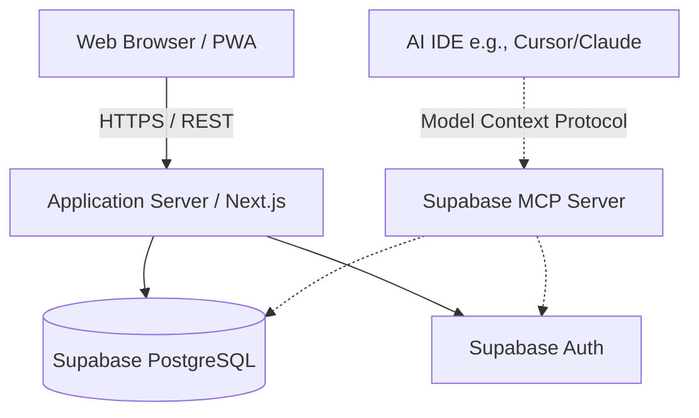

# System Architecture

## 1. High-Level Architecture Overview

The application will follow a modern, cloud-native **Single Page Application (SPA)** architecture communicating with a **RESTful / GraphQL API**, heavily relying on **Supabase** for backend infrastructure and AI-assisted development. 

## 2. Tech Stack Recommendations

### Frontend
- **Framework:** Next.js (React) or Vue 3 (Nuxt). Provides excellent performance, routing, and component reusability.
- **State Management:** React Query / SWR (for server state and caching) + Zustand (for local UI state).
- **Styling:** Tailwind CSS + a component library like shadcn/ui or Radix UI for rapid, accessible development.
- **PWA (Progressive Web App):** Configure service workers so users can install the app on their phone home screen for quick expense entry.

### Backend & Database (Supabase + MCP)
- **Primary Datastore:** Supabase (PostgreSQL). Excellent relational integrity, which is crucial for financial data.
- **Authentication:** Supabase Auth. Offloads the security and complexity of password resets, 2FA, and social logins.
- **AI Integration (MCP):** The development workflow will utilize the official **Supabase Model Context Protocol (MCP) server**. This bridges the gap between AI tools (like Cursor or Claude) and the Supabase project, enabling natural language commands and agent-like experiences for database management.

## 3. Data Model (Relational Schema Draft)

- `users` (id, email, name, created_at)
- `families` (id, name, created_at)
- `family_members` (user_id, family_id, role, joined_at)
- `categories` (id, family_id, name, icon, is_active)
- `budgets` (id, category_id, family_id, month, year, amount_limit)
- `expenses` (id, family_id, category_id, user_id, amount, date, description)

## 4. Key Architectural Decisions
- **Multi-Tenancy Strategy:** We will leverage Supabase's powerful **Row-Level Security (RLS)** strictly isolating data using `family_id` on every core table to ensure data does not leak between families.
- **AI-Native Development Workflow:** By running the Supabase MCP server locally, AI assistants can autonomously inspect the schema, generate and execute SQL, author migrations, and debug RLS policies directly against a development database.
- **Security & Best Practices:** We will point the MCP server at a dedicated development/staging Supabase project rather than production to prevent accidental data modification by AI agents.
